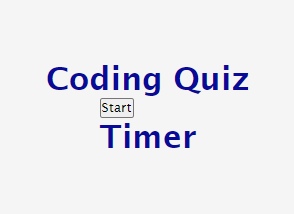
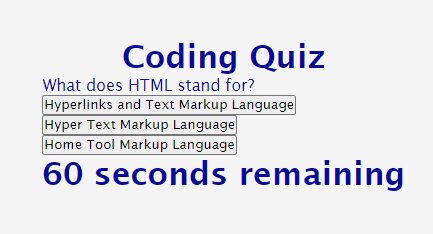
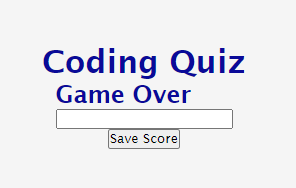

# 04-Coding-Quiz

## Description

This project is designed to test the user's knowledge in coding. While working on this project, I was also able to practice and develop my JavaScript skills. 
One of the main problems I encountered while working on this coding quiz was understanding how functions work, specifically how scope affects a function. I was able to learn and troubleshoot my issues with scope as I worked through this project.

## Installation

There is no installation needed to use this project. 

## Usage 

Open the following link on your favorite browser.
Click on the Start button to initiate the Coding Quiz and use the timer to keep track of your time left.

https://volcomix13.github.io/04-Coding-Quiz/

## Credits

## License

Please refer to License file in repository

